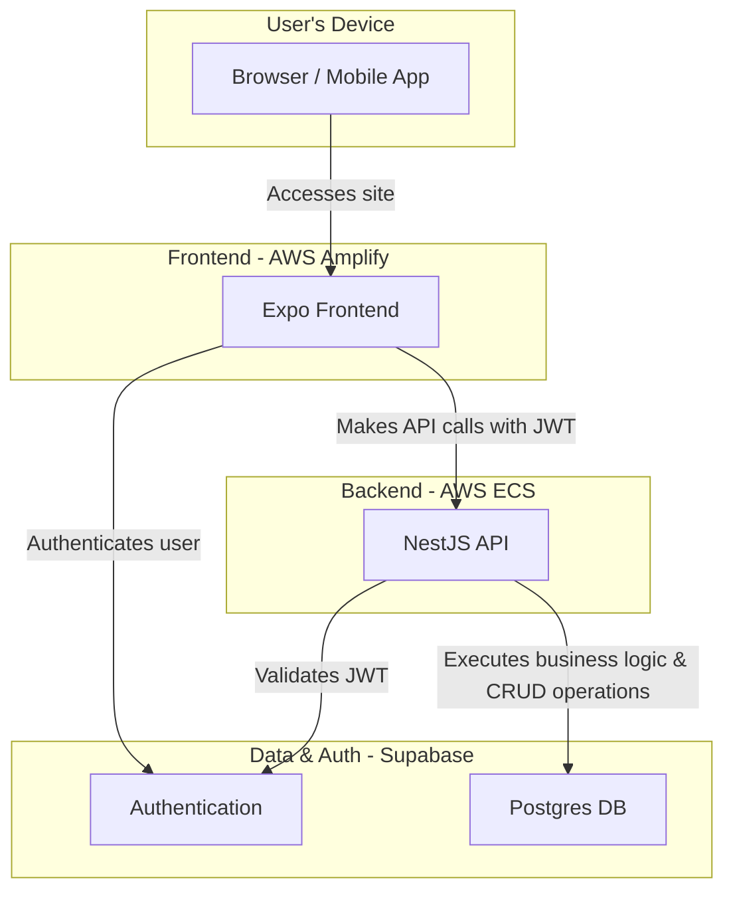
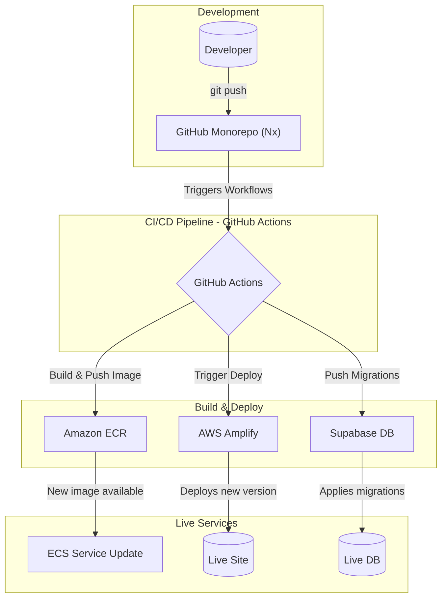

# AutoNote: System Architecture Overview

This document provides a high-level overview of the complete technical architecture for the AutoNote application. It describes how the frontend, backend, database, and deployment pipelines work together to deliver the application.

---

## **1. Core Principles**

The architecture is built on modern, cloud-native principles to ensure scalability, reliability, and developer efficiency.
- **Monorepo:** All code (frontend, backend, shared types) is managed in a single Nx workspace for consistency and easy code sharing.
- **Infrastructure as Code (IaC):** All infrastructure and deployment configurations (`Dockerfile`, `amplify.yml`, GitHub Actions workflows) are defined as code and stored in the Git repository.
- **Serverless First:** We leverage managed, serverless services (AWS Fargate, AWS Amplify, Supabase) wherever possible to reduce operational overhead.
- **Continuous Deployment:** All components of the stack are deployed automatically via GitHub Actions upon merges to the `main` branch.

---

## **2. Application Architecture**

This diagram shows how the live components of the system interact.

## **3. CI/CD Deployment Flow**

This diagram illustrates the automated CI/CD pipeline from code push to deployment.

---

## **4. Detailed Component Breakdown**

### **Frontend: Expo Application**
- **Framework:** Expo (React Native)
- **Hosting:** **AWS Amplify Hosting**
- **Description:** A cross-platform application that runs on web and mobile. It communicates with the backend via REST API calls and directly with Supabase for user authentication.
- **Deployment:** Automatically built and deployed by AWS Amplify when changes are pushed to `apps/app/**`. The configuration is managed in `amplify.yml`.

### **Backend: NestJS API Server**
- **Framework:** NestJS (Node.js)
- **Hosting:** **Amazon ECS with AWS Fargate**
- **Container Registry:** **Amazon ECR**
- **Description:** A containerized API server that handles all business logic. It exposes a REST API that the frontend consumes. It connects to the Supabase database for data operations.
- **Deployment:**
    1. Changes to `apps/server/**` trigger a GitHub Actions workflow.
    2. The workflow builds a Docker image and pushes it to Amazon ECR.
    3. The ECS service is then updated to pull the new image from ECR, performing a rolling update to deploy the new container with zero downtime. This update step can be automated.

### **Database: Supabase**
- **Provider:** Supabase (hosted PostgreSQL)
- **Schema Management:** Supabase CLI
- **Description:** Provides the core database, user authentication, and authorization services. The database schema is managed via migration files stored in the `supabase/migrations` directory.
- **Deployment (Schema Changes):**
    1. Changes to `supabase/migrations/**` trigger a GitHub Actions workflow.
    2. The workflow connects to the live Supabase database and applies the new migrations using `supabase db push`.

### **Shared Code**
- **Location:** `libs/shared`
- **Description:** A shared TypeScript library within the monorepo that holds code used by both the frontend and backend.
- **Current Use:** It contains the auto-generated TypeScript type definitions for the Supabase database schema, ensuring end-to-end type safety. 